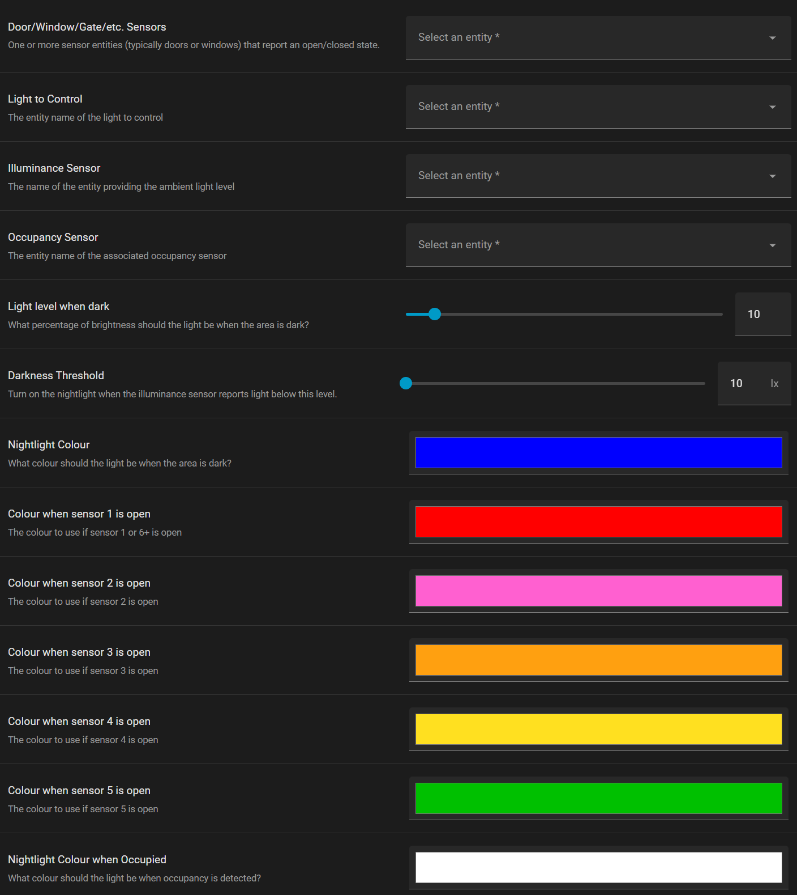

# Night Light Control
Control a night light such as the [ThirdReality Multi-Function Night Light](https://thirdreality.com/product/multi-function-night-light/)
based on the status of a door / window / gate, motion sensor, and ambient light.

**Version v2026.02.09**

This blueprint adds an automation which will turn a night light on at
a particular colour if a door / window / gate is open, allowing you to see
if the garage door or a basement window is open for example. If none
of the configured entities are open but occupancy is detected, the light
will be set to a different colour. Finally, if none of the other conditions
are met but the room is dark, the night light will be set to a configurable
colour at a lower level of brightness.

If you find this useful and would like to show your support, please
click on the **🩷&nbsp;Sponsor** button in my GitHub repo.

## Configuration

The blueprint requires four different types of entities to be specified so
that it knows which device to control, how bright the room is, etc.
See below for a more detailed description of each setting.

**Door/Window/Gate/etc. Sensors**

One or more sensor entities that report an open/closed state. This would
typically be something like a garage door, a patio door, a window, or a gate,
but it can be any binary sensor that reports its status as on/off.

If the item you select is open, i.e., its binary sensor state is "on", the
light will be turned on to 100% brightness and set to a particular colour.

Multiple entities can be specified, and the order is important. Specify the
most important one first and the least important one last. If multiple items
are open, the one listed first is the one used to select the light colour.

**Light to Control**

The light device for the night light. If you have a switch that controls a light
and it shows up in Home Assistant as a switch, see the
[Change device type of a switch](https://www.home-assistant.io/integrations/switch_as_x/)
helper to create a light device from the switch.

**Illuminance Sensor**

The night light's illuminance sensor, or any other illuminance sensor that
will tell you when the room containing the night light is "dark".

**Occupancy Sensor**

The night light's occupancy sensor, or any other occupancy sensor that
will tell you when the area around the night light is occupied and thus
the night light should turn on.

The selector allows you to choose either a motion sensor or occupancy sensor device,
but you typically want to use an occupancy sensor unless you only want the
night light to be on while someone walks by, then go off as soon as they're
gone or no longer moving. Some devices appear as motion sensors but actually
behave more like occupancy sensors since they wait for a short period of time
before changing to the "off" state.

**Light level when dark**

The brightness setting to use in night light mode when the room is dark.

**Darkness Threshold**

The night light will be turned on if the room's ambient light falls below this level.

**Nightlight Colour**

The colour to use in night light mode when the room is dark.

**Colour when sensor X is open**

There are 5 of these colour settings corresponding to the sensors configured
in the Door/Window/Gate/etc. Sensors setting.

If the first configured sensor reports a status of "on", the light will be
turned on using colour 1 at full brightness.

Similarly, the other configured colours are used if sensors 2-5 report a status
of "on", but no earlier sensor reports a status of "on". If the 2nd and 4th
configured sensors both report a status of "on", colour number 2 is used
at full brightness.

If more than 5 sensors are configured, sensors 6 and up will all use the first
configured colour.

**Nightlight colour on Occupancy**

The colour to use (at full brightness) if none of the configured sensors report
a state of "on", but occupancy is detected.
